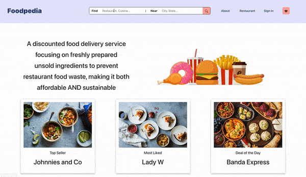
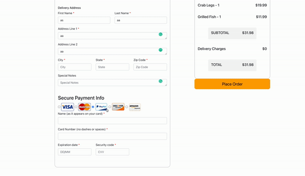
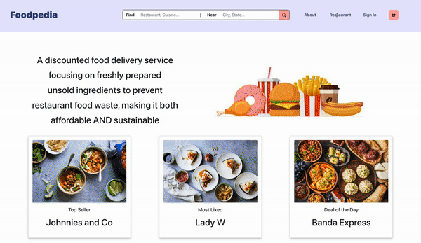

# Foodpedia-React-Application

## Deployed on GH-Pages
https://developer-soni.github.io/Foodpedia

## Description
A food ordering and delivery application to save food, make it affordable to customers and profitable to restaurants.

### Our Motto 
* Our application focuses on saving the food and helping people utilise it at a discounted price. We partner with restaurants and they can list their leftover food menu items or ingredients at a lower rate than the competitors, without any additional fees, to save their food from going to waste. 
* Our focus is to save the leftover food and ingredients in restaurants at the end of each day which would either go to waste or expire. For restaurants, it is extremely difficult to order the precise amount of food needed to satisfy demand on a weekly/ biweekly basis. 
* All surplus meals bought through FoodPedia
helps restaurants cut down on costs, gain exposure and compete with big
restaurant chains. 
* To encourage the practice of saving the environment and
food, we will reimburse all partnering restaurants for the packaging material
used for the orders if they are 100% compostable and eco-friendly.

### Tools Used 
- Draw.io for low fidelity designs
- Figma for high fidelity designs
- React/Redux for frontend library
- Bootstrap as a framework
- Selenium for automated UI QA testing

## Documentation
https://drive.google.com/file/d/1QbFPNhWRPDmcjTGgBGgrdMatKNnSNNwB/view?usp=sharing (Please do not edit/ comment on the file)

## Run and test the Foodpedia Website
In the project directory/ foodpedia, you can run:

`npm install` \
`npm start` \
This project was bootstrapped with Create React App.  
Runs the app in the development mode.  
Open http://localhost:3000 to view it in the browser.

The page will reload if you make edits.\
You will also see any lint errors in the console.

## Screenshots and Rundown of Website

### Customer Interface 1

### Confirmation Interface 2

### Restaurant Interface 3

